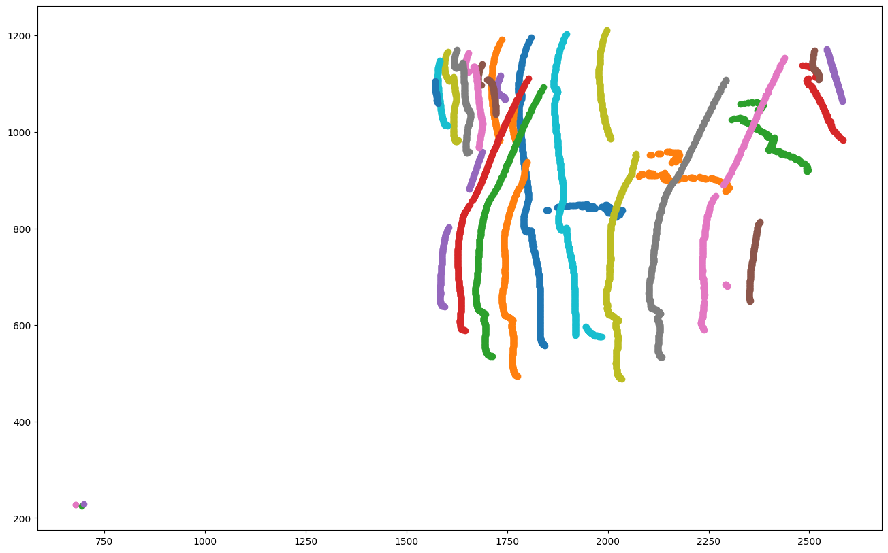

# Monkey 3D reconstruction

## Description
This project focuses on implementing stereovision techniques in computer vision. Stereovision is a method that uses two or more cameras to create a 3D perception of the environment. The goal of this project is to develop algorithms and techniques to extract depth information from stereo image pairs.

## Steps
- Image rectification
- Disparity map generation
- Depth map estimation
- Point cloud visualization

The objective is to reconstruct a 3D object from the perspective of a 2D camera :
- This is the 3D object to reconstruct :

- This is 2 pictures of this object with a stereocamera :

- This is the final reconstructed image :
